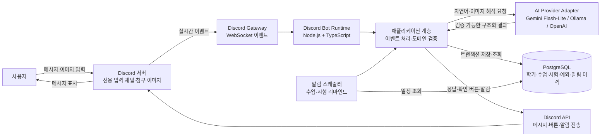
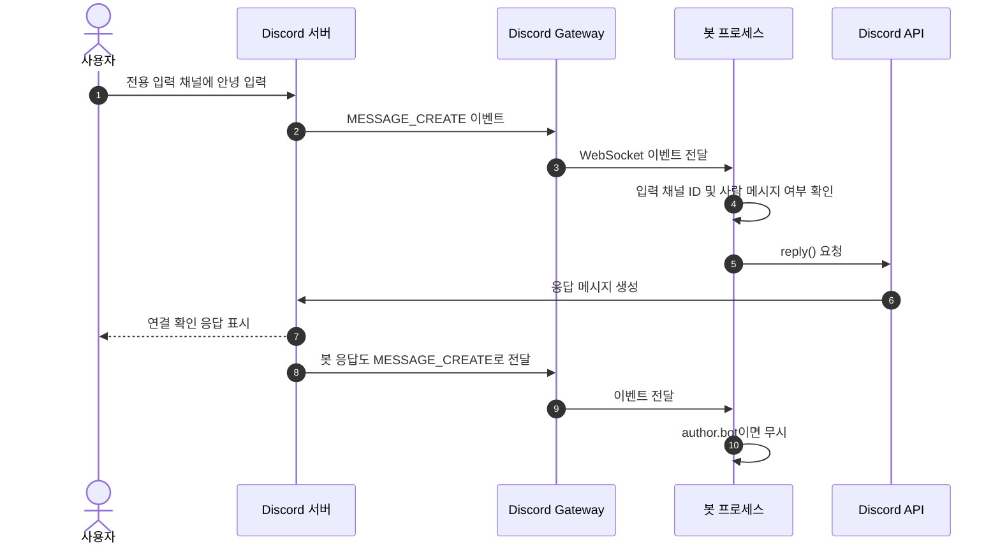
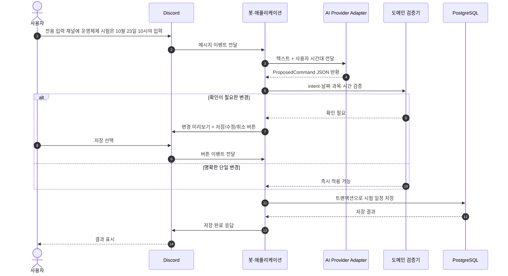
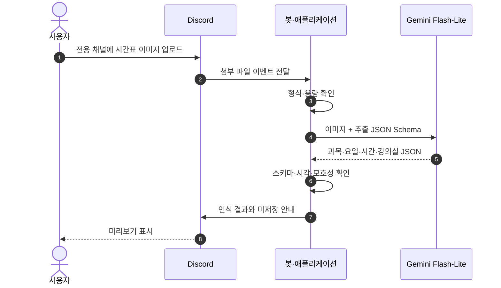

# Discord AI Assistant

Discord를 인터페이스로 사용하는 개인 학기·수업 AI 비서 MVP입니다.

사용자는 Discord에서 자연어 또는 시간표 이미지를 입력하고, 봇은 이를 일정 데이터로 구조화해 저장한 뒤 수업·시험 알림을 보냅니다.

## 현재 상태

- 로컬 PostgreSQL 실행 구성 완료
- 설정된 Discord 전용 입력 채널의 사람 메시지 처리 연결 완료 (멘션 불필요)
- Gemini·Ollama·OpenAI 교체를 고려한 AI 인터페이스 정의 완료
- Gemini Flash-Lite 텍스트 해석 어댑터 연결 완료
- 일정 기능으로 분류되지 않은 메시지에 대한 무기억 일반 대화 응답 연결 완료
- Open-Meteo 기반 현재 날씨 조회 연결 완료
- 시간표 이미지 AI 분석 및 저장 전 미리보기 연결 완료
- 일정 DB 저장·확인 UI·알림 스케줄러는 미구현

## 시스템 아키텍처



### 구성 요소별 책임

| 구성 요소 | 책임 |
| --- | --- |
| Discord | 사용자 입력과 봇 응답을 보여주는 인터페이스 |
| Discord Gateway | Discord에서 발생한 메시지·첨부 이벤트를 봇으로 전달 |
| Discord API | 봇이 메시지·버튼·알림을 Discord에 전송하는 통로 |
| Bot Runtime | 프로세스 시작, Discord 연결, 이벤트 수명 관리 |
| 애플리케이션 계층 | AI 결과 검증, 확인 필요 여부 판단, 도메인 command 실행 |
| AI Provider Adapter | 공급자별 SDK를 감싸고 일정 해석·시간표 분석·일반 대화 응답을 공급자 중립 계약으로 제공 |
| PostgreSQL | 일정 상태의 유일한 사실 원천 |
| 알림 스케줄러 | DB 일정과 예외를 기준으로 알림 작업 실행 |

## 메시지 처리 시퀀스

현재 구현된 “전용 입력 채널 메시지 → 기본 응답” 흐름입니다. `DISCORD_INPUT_CHANNEL_ID`로 지정한 채널에서만 처리하며, 봇 멘션은 필요하지 않습니다.



## 일정 등록 시퀀스

현재 Gemini 연결이 완료된 상태이며, PostgreSQL 저장은 다음 단계입니다.



## 시간표 이미지 처리 시퀀스

현재 구현은 이미지 인식 결과와 모호한 항목을 미리 보여주는 단계까지입니다. DB 저장과 저장 승인 UI는 아직 연결되지 않았습니다.



## 데이터 흐름 원칙

```text
Discord 입력
  → AI 구조화 출력
  → 스키마·도메인 검증
  → 사용자 확인(필요한 경우)
  → PostgreSQL 트랜잭션
  → Discord 응답 또는 알림
```

LLM의 대화 기억은 일정 데이터의 사실 원천으로 사용하지 않습니다. 실제 학기·수업·시험·휴강·알림 상태는 PostgreSQL에 저장합니다.

## 로컬 실행

```bash
cp .env.example .env
npm install
npm run db:up
npm run dev
```

`.env`에는 `DISCORD_BOT_TOKEN`, `DISCORD_INPUT_CHANNEL_ID`, `GEMINI_API_KEY`를 입력합니다. 비밀값은 Git이나 채팅에 올리지 않습니다.

로컬 PostgreSQL은 기본적으로 `localhost:5433`에서 실행됩니다. 자세한 내용은 [로컬 개발 안내](docs/implementation/local-development.md)를 참고하세요.

## 개발 규칙

작업 전 [AGENTS.md](AGENTS.md)와 [문서 색인](docs/README.md)을 읽습니다. 제품 범위는 [MVP 요구사항](docs/mvp-requirements.md), 공급자 교체 원칙은 [AI 공급자 결정 기록](docs/decisions/2026-09-20-ai-provider-abstraction.md)을 기준으로 합니다.
